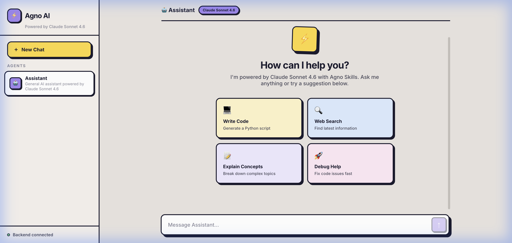

# ⚡ Agno AI — Full-Stack AI Chat App

A full-stack AI chat application built with **Agno Agent Skills**, **Claude Sonnet 4.6** via OpenRouter, and **Tavily** for real-time web search. Features a bold **Neubrutalism** UI design.



---

## ✨ Features

- 🤖 **Agno Agent Skills** — Modular, hot-reloadable AI skills framework
- 🧠 **Claude Sonnet 4.6** — Anthropic's latest model via OpenRouter
- 🔍 **Tavily Web Search** — Real-time web search powered by Tavily
- 📡 **Streaming Responses** — Real-time token-by-token SSE streaming
- 🎨 **Neubrutalism UI** — Bold borders, hard shadows, colorful cards
- ⚡ **One-Command Startup** — Run everything with `./start.sh`
- 💬 **Markdown Rendering** — Code blocks, bold, lists, tables in chat
- 🔄 **New Chat** — Clear conversations with one click
---

## 🛠️ Tech Stack

| Layer | Technology |
|-------|-----------|
| **AI Framework** | [Agno](https://github.com/agno-agi/agno) (Skills + Agents) |
| **LLM** | Claude Sonnet 4.6 via [OpenRouter](https://openrouter.ai) |
| **Web Search** | [Tavily](https://tavily.com) |
| **Backend** | FastAPI + Uvicorn |
| **Frontend** | React 19 + Vite |
| **Styling** | Vanilla CSS (Neubrutalism) |
| **Streaming** | Server-Sent Events (SSE) |

---

## 📁 Project Structure

```
react-agno-ai-app/
├── backend/
│   ├── main.py              # FastAPI server with SSE streaming
│   ├── agents.py            # Agno agent with Claude Sonnet 4.6
│   ├── skills/              # Modular AI skill directories
│   │   └── sample-skill/
│   │       └── SKILL.md     # Skill definition file
│   ├── requirements.txt     # Python dependencies
│   ├── .env                 # API keys (create from .env.example)
│   └── .env.example         # Environment template
├── frontend/
│   ├── src/
│   │   ├── App.jsx          # Main app with sidebar + chat layout
│   │   ├── App.css          # Neubrutalism design system
│   │   ├── index.css        # Base reset styles
│   │   └── components/
│   │       ├── ChatWindow.jsx    # Chat with streaming + welcome screen
│   │       ├── MessageBubble.jsx # Messages with markdown + avatars
│   │       ├── Sidebar.jsx       # Branding + agents + status
│   │       └── AgentCard.jsx     # Agent selection card
│   ├── index.html
│   ├── package.json
│   └── vite.config.js
├── assets/                  # Screenshots & media
├── start.sh                 # One-command startup script
└── README.md
```

---

## 🚀 Quick Start

### Prerequisites
- Python 3.10+
- Node.js 18+
- [OpenRouter API Key](https://openrouter.ai/keys)
- [Tavily API Key](https://app.tavily.com)

### 1. Clone & Configure

```bash
git clone <your-repo-url>
cd react-agno-ai-app
```

### 2. Set Up Environment Variables

```bash
cp backend/.env.example backend/.env
```

Edit `backend/.env` and add your keys:

```env
OPENROUTER_API_KEY=your_openrouter_key_here
TAVILY_API_KEY=your_tavily_key_here
```

### 3. Run the App

```bash
chmod +x start.sh
./start.sh
```

This will:
- Create a Python virtual environment
- Install backend dependencies
- Start the FastAPI server on `http://localhost:8000`
- Install frontend dependencies
- Start the Vite dev server on `http://localhost:5173`

### Or Run Manually

**Backend:**
```bash
cd backend
python3 -m venv venv
source venv/bin/activate
pip install -r requirements.txt
uvicorn main:app --reload --port 8000
```

**Frontend:**
```bash
cd frontend
npm install
npm run dev
```

---

## 🧩 Creating Custom Skills

Add new skill directories in `backend/skills/`. Each skill needs a `SKILL.md` file:

```
backend/skills/
└── my-custom-skill/
    ├── SKILL.md          # Required: skill instructions
    ├── scripts/          # Optional: helper scripts
    └── references/       # Optional: reference docs
```

Example `SKILL.md`:

```yaml
---
name: my-custom-skill
description: Description of what this skill does
---

# My Custom Skill

## When to Use
- When the user asks about X

## Process
1. Step one
2. Step two
```

Skills are loaded automatically — no restart required.

---

## 🔌 API Endpoints

| Method | Endpoint | Description |
|--------|----------|-------------|
| `GET` | `/api/health` | Health check + model info |
| `GET` | `/api/agents` | List available agents |
| `POST` | `/api/chat` | Send message, get response |
| `POST` | `/api/chat/stream` | Send message, get SSE stream |

---

## 🎨 Design System — Neubrutalism

The UI follows a **Neubrutalism** design language:

- **Light warm background** (`#e8e4df`)
- **Thick black borders** (`2.5px solid #1a1a2e`)
- **Hard offset shadows** (`4px 4px 0px #1a1a2e`) — no blur
- **Bold colorful accents** — purple, blue, yellow, green, red
- **Chunky interactions** — elements shift on hover/click
- **Extra-bold typography** — 700-900 weight Inter font

---

## 📄 License

MIT

---

**Built with ❤️ using [Agno](https://github.com/agno-agi/agno), [Claude Sonnet 4.6](https://openrouter.ai/anthropic/claude-sonnet-4.6), and [Tavily](https://tavily.com)**
